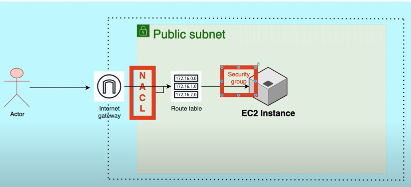

Project 1:  NACL and Security Group

<h1> WorkFlow Chart </h1>

To Do:

1. Go to Vpc --> Create Vpc --> * Select Vpc and more
                                * name tag - New_Vpc
                                * IpV4 CIDR Block - 10.0.0.0/16
                                * Disable --> Vpc endpoint s3.
                                Click Create Vpc.      [ This will automatically create public private subnet, IGW, Nacl, route tables etc. ]

2. Go to Ec2 --> Create Ec2 instance [ Ubuntu, t2.micro, assign keypair, Vpc --> Select the created Vpc, Subnet - public, Auto assign public Ip - enable, Security Group - port 22 SSH]

3. Open Ec2 Instance Connect --> * sudo apt update
                                 * python3 -m http.server 8000

4. Go to Browser --> paste public Ip:8000    [ It will not work ]

5. Go to Security group --> In inbound rules [ allow custom Tcp - 8000 Anywhere Ipv4 ]

6. Go to Browser --> paste public Ip:8000    [ Now It will work ]

7. Now Go to Acl --> Click the Nacl which is automatically created while creating Vpc. In Inbound rule of Nacl.

< img src-"Screenshot_2.PNG" width-"700 px">

8. In the inbound rule --> Add rule [ Rule No - 80, Custom tcp, port - 8000, deny]  

 Note: Least Rule Number will have high priority. For example in inbound rule there are rules which is 100 ( which allow port 8000) and 80 ( which deny port 8000). So here rule number 80 will take priority.

9. Go to Browser --> paste public Ip:8000    [ It will not work ]

Note: [ Different cases ]

1. IF port 8000 allowed in Nacl and it is not allowed in Security Group  -->  The port will not work.

2. IF port 8000 Denied in Nacl and it is allowed in Security Group  -->  The port will not work.

3. IF port 8000 allowed in Nacl and also allowed in Security Group  -->  Then the port will work.

